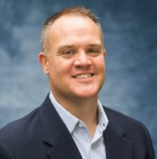

## Kelly Brownsberger
[linkedin](https://www.linkedin.com/in/kellybrownsberger) | resume@kellybrownsberger.com

### Summary
Dynamic architect and technologist with extensive experience across the software development lifecycle. Passionate about agile, lean, and DevOps methodologies, I leverage technology to drive business success. Known for building scalable systems that delight users, I combine strategic thinking with practical execution. I thrive on challenges, consistently delivering solutions that exceed expectations and inspire teams to achieve more.

References available upon request.

### Experience

#### CSG Systems (July 2021 - Present)
##### Senior Principal Systems Architect
As one of only seven architects at CSG to hold the prestigious Senior Principal title, I lead the charge in transforming our Ascendon billing system into a cutting-edge, cloud-native, serverless platform. This strategic overhaul not only facilitated CSG's expansion into the APAC and EU markets—previously deemed cost-prohibitive—but also set a new standard for scalability and efficiency. My role extends beyond technical leadership; as a voting member of the Enterprise Architecture Review Board, I am a trusted advisor on DevOps, architecture, security, and operational efficiency. I am currently pioneering the integration of Agentic AI coding assistants, a move that is revolutionizing our development processes. The success of these initiatives has inspired similar transformative projects across our portfolio, underscoring my ability to drive innovation and deliver tangible business results through hands-on leadership and strategic vision.

#### PeopleScout (TrueBlue) (Oct 2019 - July 2021)
##### Senior Systems Architect
Chief Architect for PeopleScout, leading the technology roadmap and platform architecture for the Affinix platform. Spearheaded key partner integrations and maintained the continuous integration process. Built frameworks and tools that empowered feature squads, while engaging in strategic planning with stakeholders. My leadership was pivotal in driving technology adoption and operational excellence. Key technologies included Java, NodeJS, Python, and AWS services.

#### Autobooks (Sept 2018 - Oct 2019)
##### Development Team Lead
Led development for a fintech startup, balancing feature development, production support, and architecture. Drove the transition to a cloud-native platform, enhancing scalability and performance. My leadership fostered a culture of innovation and resilience, ensuring the team consistently met ambitious goals. Utilized .NET Core, SQL Server, and Azure services.

#### CSG International (2006 - 2018)
###### Principal Systems Architect - Remote Employee
Contributed to the design and development of CSG's next-gen delivery pipeline and led automation standards for a corporate-wide DevOps transformation. As a key architect, I drove consistency and agility across the organization, mentoring teams and delivering impactful solutions. Technologies included C#, .NET Core, and Jenkins.

###### Systems Architect - Chicago, IL
Architected and led development for CSG's CSR desktop application and UI framework standardization. Successfully rolled out Silverlight as a UI technology, impacting multiple applications and enhancing user experience. Worked with .NET and WPF.

#### Avanade (2003 - 2006)
###### Principal Solutions Developer - Chicago, IL
Led development for Miller Brewing Company's intranet application, managing a team and contributing to agile methods. Played a key role in developing reusable technical assets, contributing to projects that were later adopted by Microsoft. Technologies included .NET and SQL Server.

#### IBM Global Services (1999 - 2003)
###### Application Developer - Chicago, IL
Developed web applications for Nalco and the Ohio Department of Education, transitioning systems to .NET and enhancing functionality. My technical expertise and leadership were instrumental in delivering successful projects. Worked with VB6, ASP, and SQL Server.

### Education and Certifications
* 2020 - AWS Solutions Architect Associate (Aug 2020)
* 2012 - Scaled Agile Framework (SAFe) Certified
* 2005 - Microsoft Certified Solutions Developer (MCSD.NET) in C#
* 2002 - Microsoft Certified Solutions Developer (MCSD) in Visual Basic 6
* 1999 - Bachelors of Science from Missouri State University in Object Oriented Computer Information Systems with Java
* Internship (summer 1998) - Cerner (Kansas City, MO): VB5 and ASP Developer
* Internship (summer 1997) - Cerner (Kansas City, MO): VB5 Developer
* Internship (summer 1996) - Hallmark Cards (Kansas City, MO):  COBOL Developer